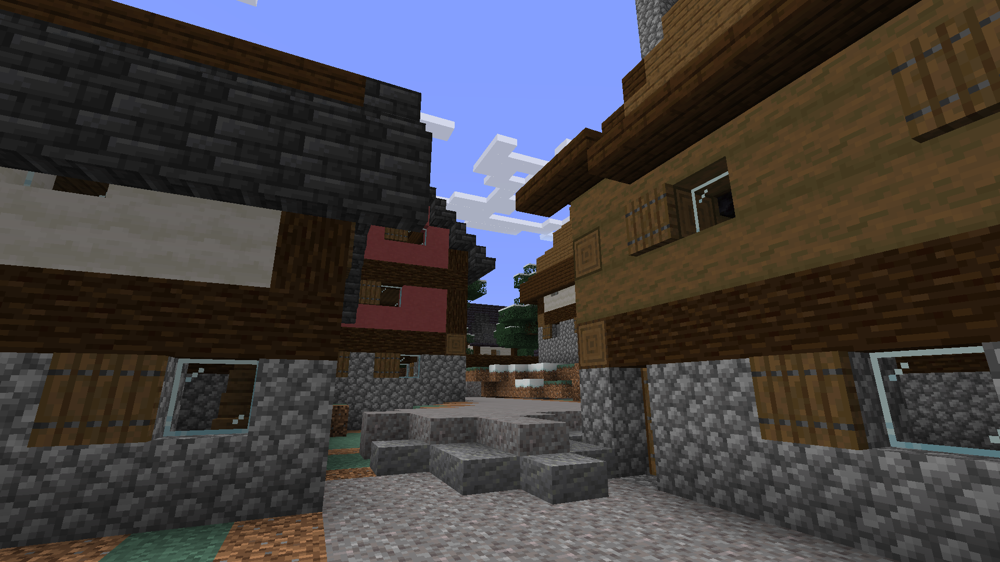

# Frightful Hobgoblin



Winning entry for the 2024 [Generative Design in Minecraft](https://gendesignmc.wikidot.com/start) competition.

The aim of GDMC is to take an existing Minecraft map and generate a settlement within it, aiming at adaptability, functionality, evocative narrative and aesthetics. While most generators generate a static instance of a village, this one runs a simulation of the village getting constructed and replays it in Minecraft. Running the replay only requires Minecraft and no mods or external programs. It also aims to be reasonably fast by working with the world directly instead of over an http interface and by using a fast language instead of a interpreted, highly dynamic one.

This code wasn't made with the intent to be useful for anyone else! There is little separation between framework and generator, no documentation/no comments, no focus on maintainability or best practices. Perhaps most importantly the internal representation of blocks only covers what I've needed myself.

The simulation works via an ECS. This means that objects such as villagers or trees are composed of components such as `Position` or `Tree`, which only carry data, and are queried by systems which implement behavior. Blocks and some ancillary data are stored in raster format.

For buildings to be constructed, villagers need to transport goods to the construction site and then place the blocks. Goods are visible both in storage and in transport. Overall the aim is to achieve a *Wuselfaktor* similar to the first Settlers games.

Each simulation tick corresponds to one game tick. Each tick, the changes to the world get written out as Minecraft commands to run during replay. As this results in hundreds of thousands of commands, getting Minecraft to run them is tricky: Placing them in mcfunction files crashes MC even if they are never executed, as they are eagerly parsed. Instead they are stored in command storage (in nbt), which get loaded via the `/data` command and executed via macros. Replays can be paused or fast-forwarded via a command.

The simulation is pseudorandom but deterministic (useful for debugging).

Performance-wise I haven't made many optimizations yet, but it world loading is parallelized and nbt encoding/gzip compression is offloaded to worker threads.

## Running

To run the generator, install [Rust](https://rust-lang.org), switch to the nightly toolchain (e.g. `rustup default nightly`) and run `cargo run --`. Running without any further arguments will tell you what configuration to provide. You can also build without running: `cargo build --release`.

Open the world in Minecraft. Each replay only runs while you're in the build area, letting you visit multiple settlements in turn. You can speed up the replay with the following command:

```mcfunction
scoreboard players set sim speed <speed>
```
Or skip ahead a number of ticks (each tick is 0.05s):

```mcfunction
scoreboard players set sim warp <ticks_to_warp>
```

Replace `<speed>` and `<ticks_to_warp>` with positive integers. Warping ahead too far at once can cause glitches in the form of missing blocks.
